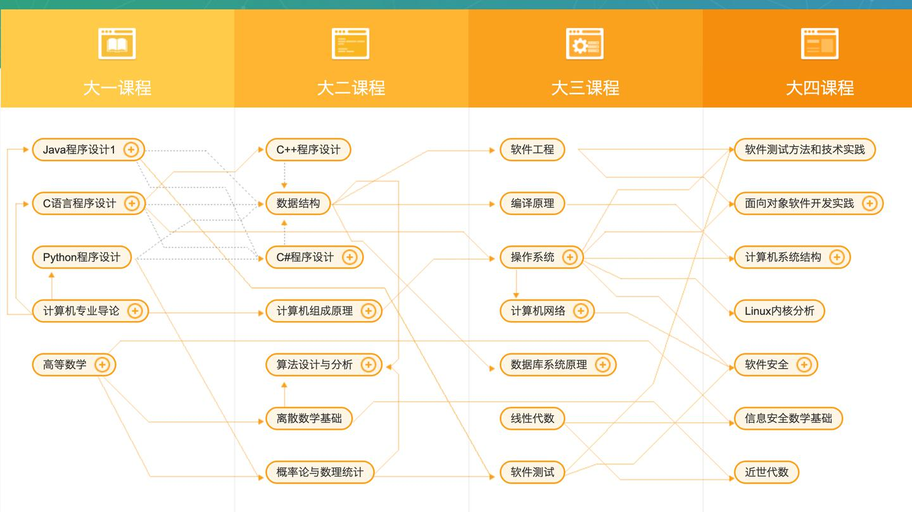

# 学如流水行舟

## 计算机网络
学习时，推荐你抓住一条主线 「一个数据包是如何发送出去的？」
《计算机网络：自顶向下方法》
这本书从我们最常接触的 HTTP、FTP、SMTP 等应用层协议讲起，可以清晰看到引入各个层的作用。
学习每层协议的时候，最好自己抓包看下，wireshark抓包遇到三次快速重传会怎么样？这样映像会更加深刻

## 数据库：
sql得会写吧，这个推荐看下《SQL必知必会》，几个范式有没有正式运用过? 如何进行领域建模、数据库设计，才能够使得每次查询的开销最小？    

数据库原理方面可以看看《数据库系统概念》，这本书挺厚的，包含了从 SQL 到数据库设计再到数据库原理、分布式数据库都有，可以挑着看，比如关系模型、数据库设计（三大范式）、数据磁盘存储和组织方式、索引、并发控制等。

当然了整个数据库最重要的还是索引和并发控制（锁、MVCC等），这部分也是面试常考的：
索引存储结构：B树、B+树索引、Hash索引
索引的使用：主键索引、覆盖索引、最左前缀原则、索引下推等
锁：乐观锁、悲观锁、表锁，行锁，意向锁，读锁，写锁等等
MySQL InnoDB MVCC 实现机制
存储引擎：InnoDB、MyISAM等，各自的优缺点
事务：ACID理论

这部分推荐两本书：《高性能MySQL》《MySQL技术内幕》

## 网络编程
推荐几本书：
《Linux高性能服务器编程》
《Unix网络编程》
《Unix环境高级编程》

如何才能减少和科班的差距？

接下来说下我认为对一个「计算机知识体系完整的毕业生」最重要的课程，你至少得把下面这些课 都学了：1、 编程语言：C/C++ （学好了这两门，基本其它编程语言一周就上手了）2、《系统级编程》(我们教材是CSAPP，这是我本科上过最值的课！System Programing)3、《数据结构与算法》4、《组成原理和体系结构》5、《操作系统》6、《编译原理》7、《计算机网络》8、《数学课》：线代、离散、高数

