# 增删改

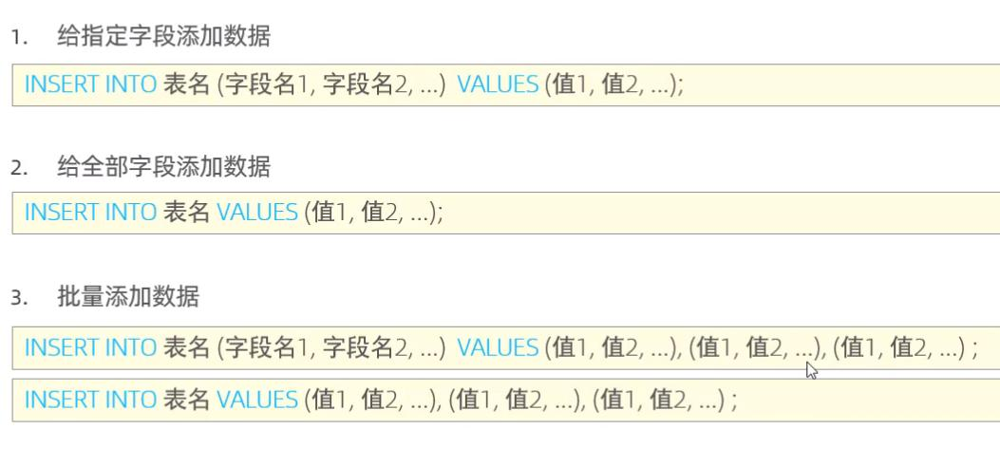
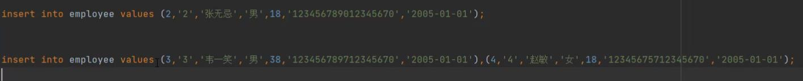

修改
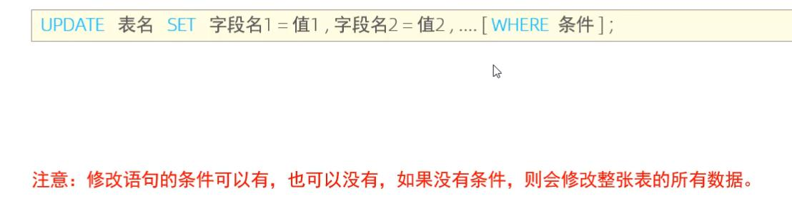
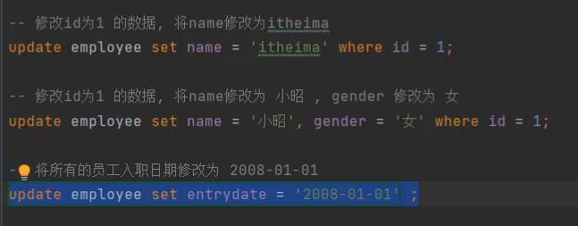

删除
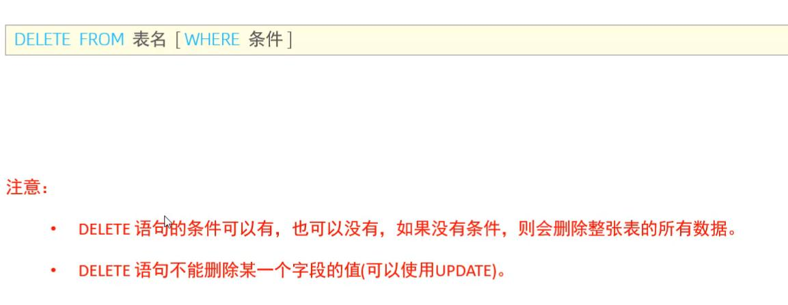
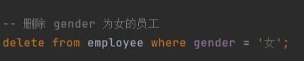

## DQL
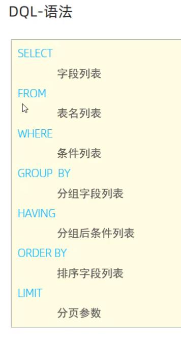


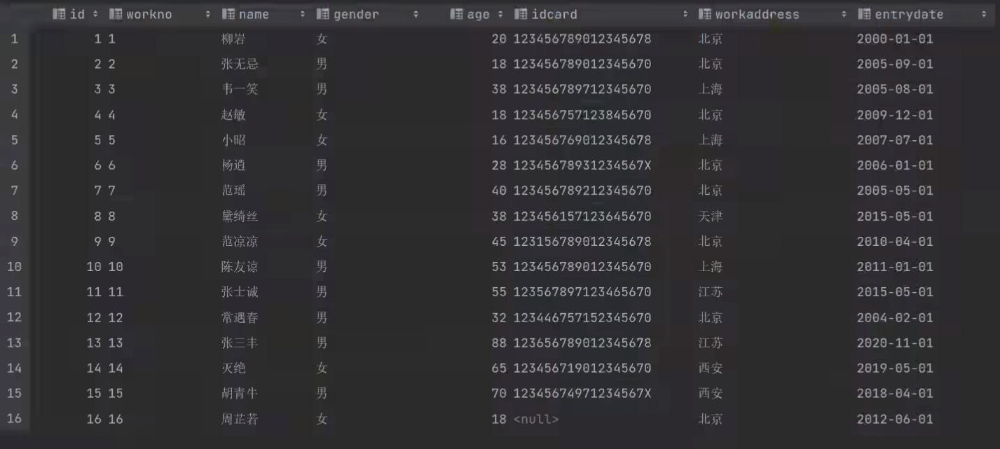
*效率底
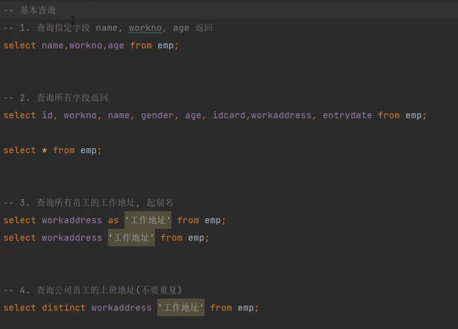

条件查询
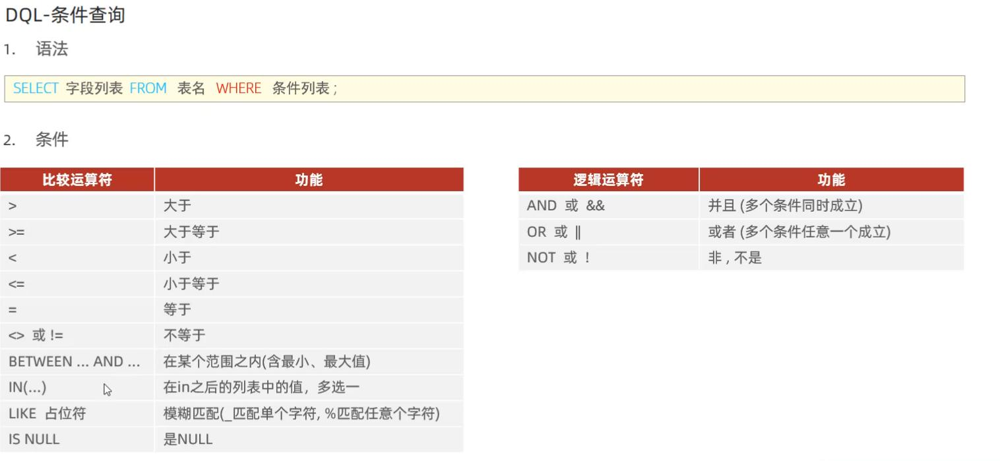

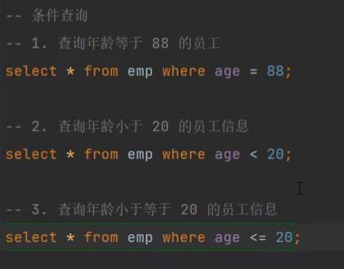
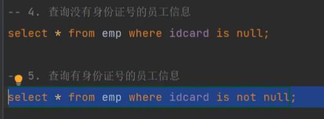
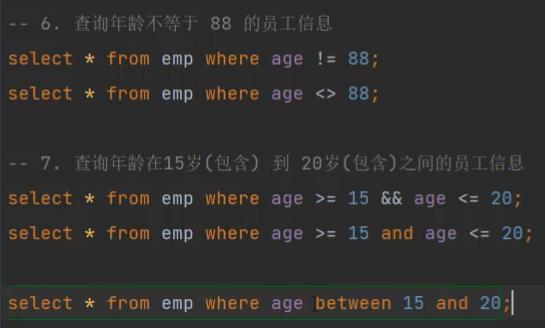
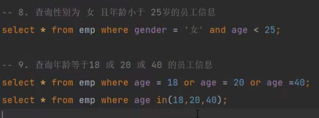
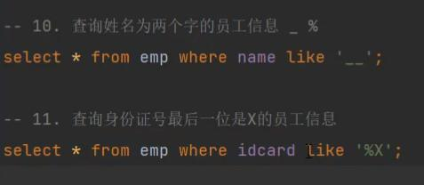


聚合函数
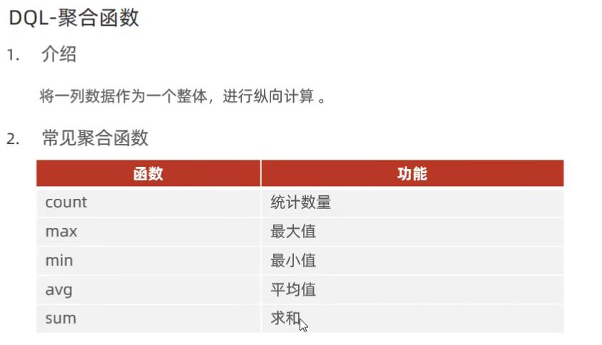

::: danger 注意
注意: null值不参与所有聚合函数运算。
:::
-- 聚合函数
-- 1.统计该企业员工数量select
```SQL
select count(*) from emp;select count(idcard) from emp;
```
-- 2.统计该企业员工的平均年龄
```SQL
select avg(age)from emp;
```
-- 3.统计该企业员工的最大年龄
```SQL
select max(age) from emp ;
```
-- 4.统计该企业员工的最小年龄
```SQL
select min(age) from emp;
```
-- 5.统计西安地区员工的年龄之和
```SQL
select sum(age) from emp where workaddress ='西安':
```

-- 分组查询
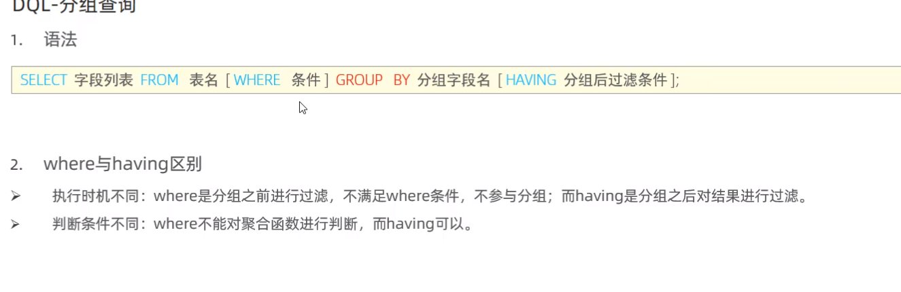
-- 分组查询
-- 1.根据性别分组 ，统计男性员工 和 女性员工的数量
```SQL
seLect gender,count(*) from emp group by gender ;
```
-- 2. 根据性别分组 ， 统计男性员工 和 女性员工的平均年龄
```SQL
select gender，avg(age) from emp group by gender ;
```

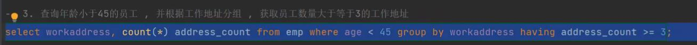
-- 3.查询年龄小于45的员工 ，并根据工作地址分组 ，获取员工数量大于等于3的工作地址
```SQL
select workaddress, count(*) address.count from emp where age < 45 group by workaddress having address.count >= 3?
```
::: danger 注意
执行顺序: where > 聚合函数 > having。

分组之后，查询的字段一般为聚合函数和分组字段，查询其他字段无任何意义
:::

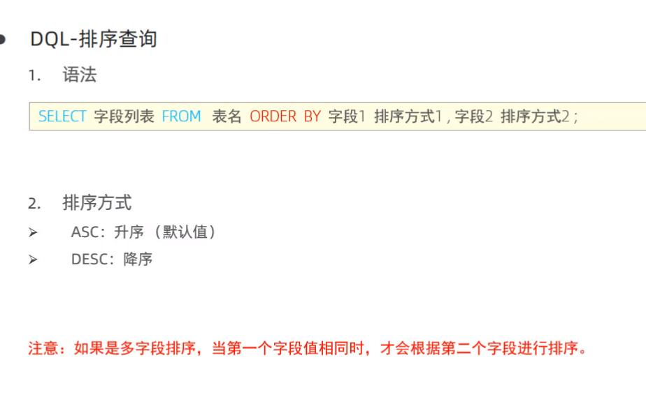
语法
```SQL
SELECT 字段列表 FROM 表名 ORDER BY 字段1 排序方式1,字段2 排序方式2;
```
排序方式
- ASC:升序(默认值)
- DESC:降序
::: danger 注意
如果是多字段排序，当第一个字段值相同时，才会根据第二个字段进行排序
:::
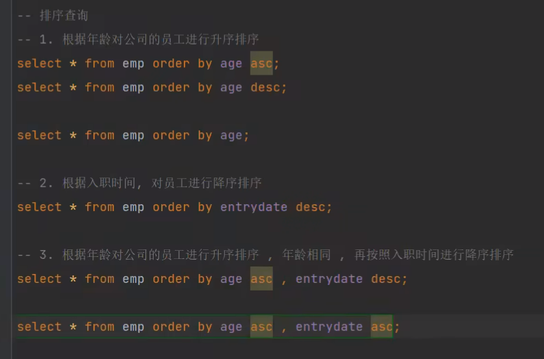

-- 分页查询
1. 查询第1页员工数据，每页展示10条记录
```SQL
select * from emp limit 0,10;

select * from emp limit 10;
```
2. 查询第2页员工数据，每页展示10条记录(页码-1)*页展示记录数
```SQL
select * from emp limit 10,10;
```

## DOL 语句练习
1. 查询年龄为20,21,22,23岁的女性员工信息。
```SQL
 select * from emp where gender = 女'and age in(20,21,22,23);
 ```
2. 查询性别为 男 ，并且年龄在 20-40 岁(含)以内的姓名为三个字的员工。
```SQL
select * from emp where gender = '男' and ( age between 20 and 40 ) and name like '___'；
```
3. 统计员工表中，年龄小于60岁的 ，男性员工和女性员工的人数。
```SQL
select gender, count(*) from emp where age < 60 group by gender;
```

4. 查询所有年龄小于等于35岁员工的姓名和年龄，并对查询结果按年龄升序排序，如果年龄相同按入职时间降序排序。
```SQL
select name , age from emp where age <= 35 order by age asc , entrydate desc;
```
5. 查询性别为男，且年龄在20-40 岁(含)以内的前5个员工信息，对查询的结果按年龄升序排序，年龄相同按入职时间升序排序。
```SQL
select * from emp where gender = 男' and age between 20 and 40 order by age asc , entrydate asc limit 5 ;
```

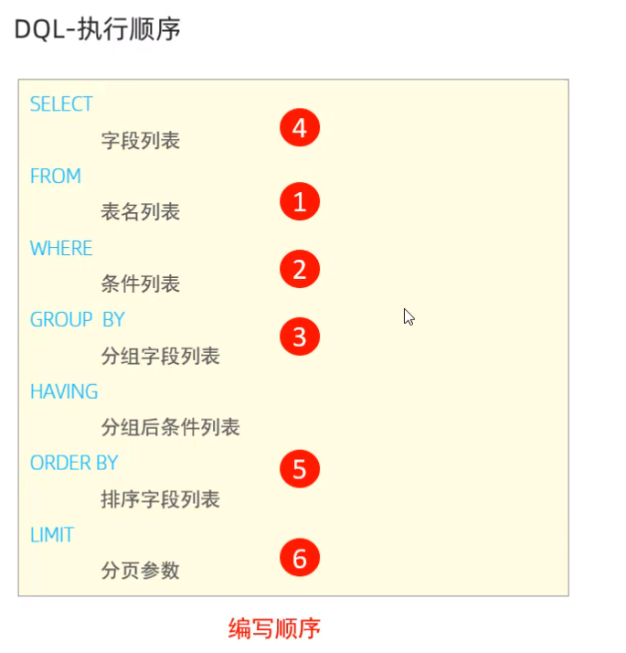


## 用户访问权限管理