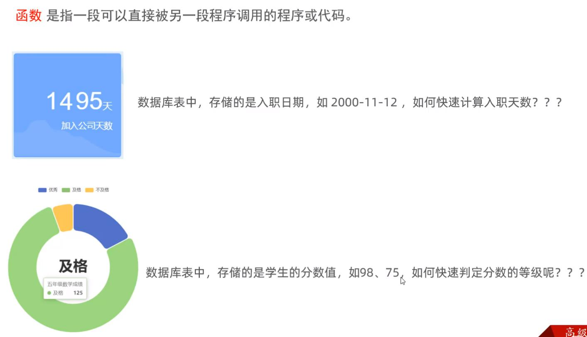
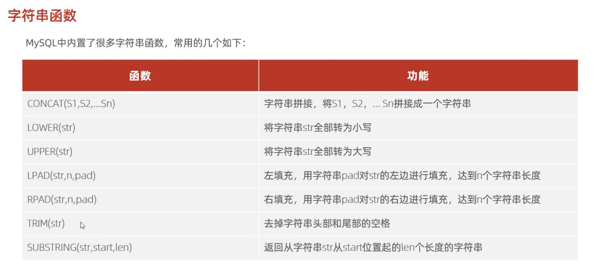
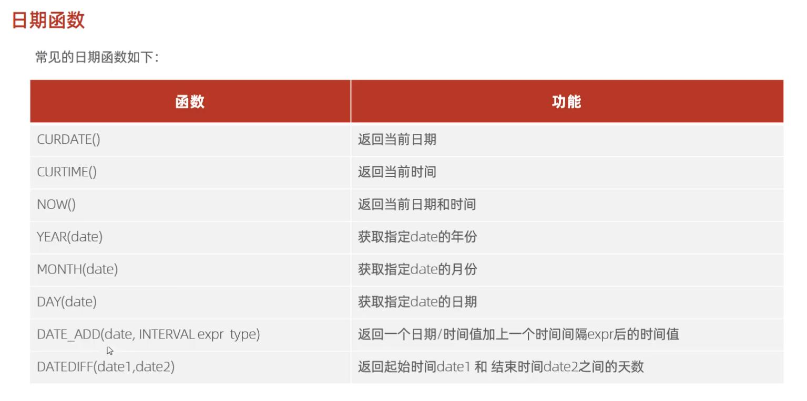
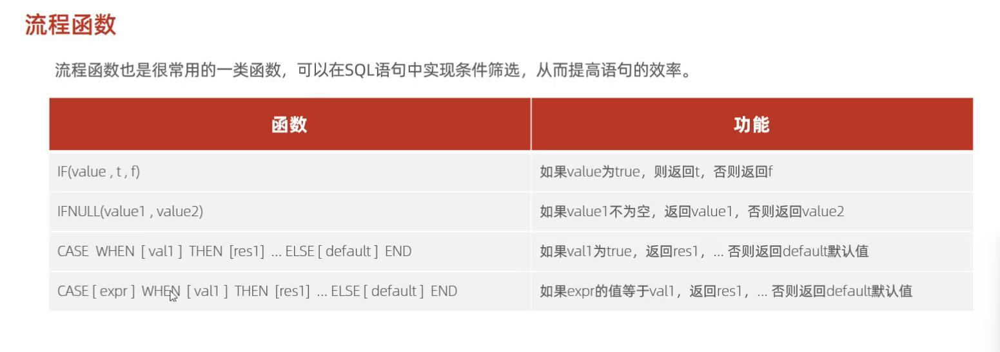
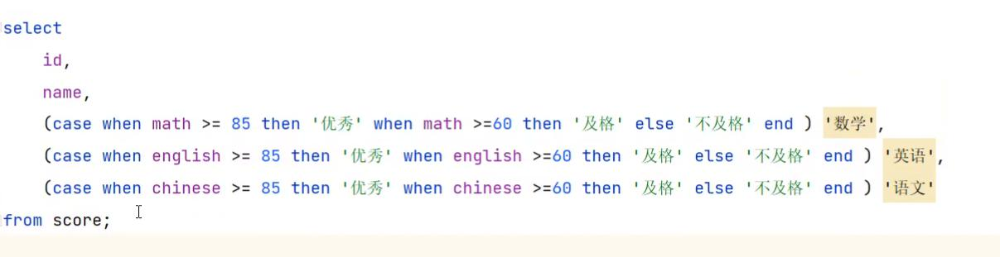

# 函数



## 数值函数
常见的数值函数如下:
|函数				|功能																|
|--					|--																	|
|CEIL(x)		|向上取整														|
|FLOOR(X)		|向下取整														|
|MOD(x;y)		|返回x/y的模												|
|RAND()			|返回0~1内的随机数									|
|ROUND(x;y)	|求参数x的四舍五入的值，保留y位小数	|



案例:  查询所有员工的入职天数，并根据入职天数倒序排序
```SQL
select name, datediff(curdate(), entrydate) as 'entrydays' from emp order by entrydays desc;
```
## 流程函数

 case when then else end
-- 需求: 查询emp表的员工姓名和工作地址 (北京/上海 ----> 一线城市 ， 其他 ----> 二线城市)
```SQL
select
	name,
	(case workaddress when'北京' then '一线城市'when '上海'then  一线城'else'二线城市'end ) as'工作地址'
from emp;
```

