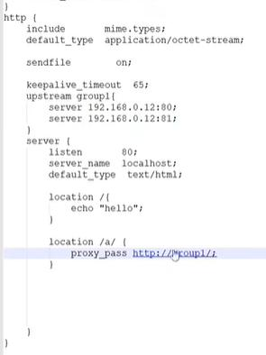

# nginx

[openresty](http://openresty.org/cn/download.html)

```
server {
  listen       80;
  server_name  localhost;
  default_type text/html;
  
  location / {
      root   html;
      index  index.html index.htm;
  }
```

## 规则
只匹配 http://localhost/a 匹配等级最高
location = /a

只匹配 http://localhost/a   
location ^~ /a // 匹配以/a开头的
 
 
 只匹配 http://localhost/a  
 location ~ /\w // 正则匹配\w 以/a开头的
 
 location / 
 匹配以/开头的
 
- 同级，按照先后顺序
location ~ ^/\w

location ~ ^/[a-z]
## 反向代理
nginx路由到其他服务器就是反向代理，它不需要客户配置；正向是面向用户，常规代理是代理客户端

代理是把访问指向某个文件

```
location /a {
  proxy_pass http://192.168.0.12:80;
}
```

访问http://localhost/a 会报错404  可以访问http://192.168.0.12/a 
```
location /a/ {
  proxy_pass http://192.168.0.12:80/;
}
```
访问http://localhost/a

## 负载均衡


upstream group1{
server 192.168.0.12:80;
server 192.168.0.12:81;

location /a/ {
  proxy_pass http://group1/1
}

设置权重

upstream group1{
server 192.168.0.12:80 weight 9; // 90%的概率访问这个地址
server 192.168.0.12:81 weight 1;

location /a/ {
  proxy_pass http://group1/1
}


## 问题  
### 405 not allowed问题解决方法

正常访问Http接口时正常，但通过nginx访问却出现405 not allowed的提示。

### 解决方案

在nginx的站点配置中添加以下error_page 405 =200  $request_uri;这句即可。

    server {
        listen       9095;
        server_name  localhost;

    #前端网站
    location / {
        root D:\dqc\portal\portal-vue;    # 静态页面根目录
        index index.html;#默认首页
        error_page 405 =200  $request_uri;
        }

}