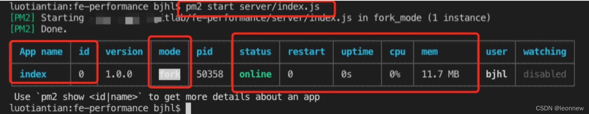

# pm2
[PM2中文网](https://pm2.fenxianglu.cn/docs/start)
pm2是node进程管理工具。

## 特性
1、后台运行
普通启动方式：node index.js，关闭终端就结束进程；
pm2可以后台运行，终端关闭不影响。

2、自动重启
可以监听某些文件改动，自动重启

3、停止不稳定的进程
限制不稳定的重启的次数，达到上限就停止进程。

4、0 秒停机重启
集群模式下，可以达到重启时不停止服务。

5、简单日志管理
pm2可以收集日志，并有插件配合进行管理。后面会提到。

6、自动负载均衡
cluster模式下，会自动使用轮询的方式达到负载均衡，从而减轻服务器的压力。

7、提供实时的接口
pm2插件提供实时的接口，返回服务器与进程的信息，后面会提到。

8、集成管理
对于多个进程，不同环境，可以统一配置，方便管理。

## 安装
```bash
npm install pm2 -g 
```

查看pm2的位置
```bash
whereis pm2
```

如果这时候还是无法运行，可以将node安装目录里面的bin目录里面的快捷方式，链接到运行目录就可以了，具体操作方法：

whereis pm2

得到的目录就是pm2所在的目录，然后加一个快捷：

```bash
ln -s /usr/software/nodejs/bin/pm2 /usr/local/bin/
```


## 使用
- 启动进程: 
```bash
pm2 start app.js
```
得到如下图

（1）其中app name 和id都是这个进程的标识，可以对他们进行别的操作，比如stop，delete等。
（2）mode：进程模式，cluster或fork。cluster有多个进程，而fork只有一个。
（3）status：进程是否在线
（4）restart：重启次数
（5）uptime：运行时间
（6）cpu：cpu占用率
（7）mem：内存占用大小

- 停止进程：
```bash
pm2 stop app_name|app_id|all
```
- 删除进程：
```bash
pm2 delete app_name|app_id|all
```
- 重启进程：
```bash
pm2 restart/reload app_name|app_id|all
```
集群模式下，restart中断服务，而reload不会

- 查看所有的进程：
```bash
pm2 list/ls/status
```
id编号从1~4的是一个应用，分别对应4个进程。

- 查看某一个进程的信息：
```bash
pm2 show app_name|app_id
```
status（状态）、restarts（重启次数）、uptime（运行时间）、script path（启动入口的路径）、script args（启动文件的参数）、error log path（错误日志的路径）、out log path（输出日志的路径）、exec mode（进程的模式）、watch&reload（是否开启监听文件变动重启）、unstable restarts（不稳定的重启次数）

heap size（堆内存）、heap usage（堆内存使用率）、used heap size（堆内存使用情况）、event loop latency（事件循环时延）、event loop latency p95（事件循环时延 第95分位）

- 查看日志：
```bash
pm2 logs
```

- 监控所有进程：
```bash
pm2 monit
```
- 启动命令（start）还可以带参数
其它可用选项：

```
--watch 以监听模式启动，当文件发生变化时自动重启
--max-memory-restart <200MB> 设置应用重载占用的最大内存
--log <log_path> 指定日志文件
-- arg1 arg2 arg3 给启动脚本传递额外的参数
--restart-delay <delay in ms> 延时 x 毫秒自动重启
--time 日志里添加时间前缀
--no-autorestart 不自动重启
--cron <cron_pattern> 按指定的定时任务规则强制重启
--no-daemon 以非守护进程模式启动
```

小结：
上面介绍的这些启动其实有弊端：
1、通过命令行传递参数，无法记住到底传递过哪些参数。
2、对于多个进程，不方便管理。

[](https://blog.csdn.net/leonnew/article/details/121989900)

启动
```bash
pm2 start app.js # 启动app.js应用程序
pm2 start app.js -i 4 # cluster mode 模式启动4个app.js的应用实例
pm2 start app.js --name="api" # 启动应用程序并命名为 "api"
pm2 start app.js --watch # 当文件变化时自动重启应用
pm2 start script.sh # 启动 bash 脚本
```

查看信息
```
pm2 list # 列表 PM2 启动的所有的应用程序
pm2 monit # 显示每个应用程序的CPU和内存占用情况
pm2 show  id# 显示应用程序的所有信息
pm2 logs # 显示所有应用程序的日志
pm2 logs id # 显示指定应用程序的日志
```

停止
```
pm2 stop all # 停止所有的应用程序
pm2 stop 0 # 停止 id为 0的指定应用程序
```

重启
```
pm2 restart all # 重启所有应用
pm2 reload all # 重启 cluster mode下的所有应用
```

删除应用
```
pm2 delete all # 关闭并删除所有应用
pm2 delete 0 # 删除指定应用 id 0
```

其他
```
pm2 gracefulReload all # Graceful reload all apps in cluster mode
pm2 scale api 10 # 把名字叫api的应用扩展到10个实例
pm2 reset [app-name] # 重置重启数量
pm2 startup # 创建开机自启动命令
pm2 save # 保存当前应用列表
pm2 resurrect # 重新加载保存的应用列表
pm2 update # Save processes, kill PM2 and restore processes
pm2 generate # Generate a sample json configuration file
pm2 start app.js --node-args="--max-old-space-size=1024"
```
重置重启次数
pm2 reset  PID //一次只能重置一个
查看 

```
# 查看所有已启动应用的基本信息
# 同 pm2 ls 或 pm2 status
pm2 list
 
# 查看所有应用的日志（历史 + 实时）
pm2 logs
pm2 logs www # 只查看应用 www 的日志
pm2 logs --lines 10 # 查看最后10条历史，默认 15 条
pm2 logs --timestamp # 实时日志添加时间前缀
pm2 logs www --lines 10 --err # 只查看应用 www 的最新 10 条错误日志
pm2 flush # ❗️清空所有日志文件
 
# 查看进程详情
pm2 show app_name|app_id
 
# 查看每个应用的CPU和内存资源实时占用情况
pm2 monit
 
# 在线的 Web 诊断系统，跨服务器
# 需要注册登录或使用 Github、Google 账户授权登录
pm2 monitor
```

 管理应用状态

```
# 重启 ❗️
# 同时杀死并重启所有进程，短时间内服务不可用。
# 生成环境推荐使用 reload
pm2 restart app_id|app_name|all
 
# 重载 👍
# 始终保持一个进程在线，避免宕机
pm2 reload app_id|app_name|all
 
# 停止
pm2 stop app_id|app_name|all
 
# 关闭并删除
pm2 delete app_id|app_name|all
 
# 直接杀死 pm2 守护进程
pm2 kill
```

 静态服务器

```
# 将目录 dist 作为静态服务器根目录，端口为 3333
pm2 serve ./dist 3333
 集群模式（自动负载均衡）

# max 表示 PM2 将自动检测可用 CPU 的数量并运行尽可能多的进程
# max 可以自定义，如果是 4 核 CPU，设置为 2 则只占用 2 核
pm2 start app.js -i max
```
 开机自启动

```
pm2 startup
pm2 unstartup
```
 应用列表

```
# 保存当前应用列表，以后可以恢复
pm2 save  # 同 pm2 dump
 
# 重新加载之前保存的应用列表
pm2 resurrect
 
# 清除保存的应用列表
pm2 cleardump
```
 配置文件

生成示例配置文件

```
pm2 ecosystem # 或 pm2 init
```
示例配置如下（根据实际项目需要添加、删除配置项）

```
module.exports = {
  apps : [{
  name      : 'demo',      // 应用名
  script    : 'app.js',   // 应用文件位置
  env: {
    PM2_SERVE_PATH: ".",    // 静态服务路径
    PM2_SERVE_PORT: 8080,   // 静态服务器访问端口
    NODE_ENV: 'development' // 设置开发环境运行时
  },
  env_production : {
    NODE_ENV: 'production'  // 设置生产环境运行时
  },
  instances: "max",         // 将应用程序分布在所有CPU核心上,可以是整数或负数
  watch: true,              // 监听模式
  output: './out.log',      // 指定日志标准输出文件及位置
  error: './error.log',     // 错误输出日志文件及位置
  merge_logs: true,         // 集群情况下，可以合并日志
  log_type: "json",         // 日志类型
  log_date_format: "DD-MM-YYYY",  // 日志的日期格式
  }],
  deploy : {
    production : {
      user : 'SSH_USERNAME',
      host : 'SSH_HOSTMACHINE',
      ref  : 'origin/master',
      repo : 'GIT_REPOSITORY',
      path : 'DESTINATION_PATH',
      'pre-deploy-local': '',
      'post-deploy' : 'npm install && pm2 reload ecosystem.config.js --env production',
      'pre-setup': ''
    }
  }
}
```

以配置文件启动示例

pm2 start ecosystem.config.js --env production
⚠️ 注意：配置文件支持 js 和 yaml 格式，还有一些没有列举的参数项，详见官方文档：https://pm2.keymetrics.io/docs/usage/application-declaration
 
 升级 PM2

```
# 更新前推荐先保存当前应用列表，方便更新后直接恢复
pm2 save
 
# 更新主程序
npm install pm2 -g
 
# 紧接着更新内存中的程序
pm2 update
 
# 恢复应用列表
pm2 resurrect
```
 日志切割

安装 pm2-logrotate-ext 扩展模块

项目地址：https://github.com/Lujo5/pm2-logrotate-ext

pm2 install pm2-logrotate-ext
重新启动应用后，pm2-logrotate-ext 以模块的形式被加载、启动。

可以通过以下命令对其配置进行修改：

```
# 当文件大小超过此设置则执行切割
pm2 set pm2-logrotate-ext:max_size 1M
 
# 保留最新的几个日志文件
pm2 set pm2-logrotate-ext:retain 30
 
# 是否开启 gzip 压缩
pm2 set pm2-logrotate-ext:compress false
 
# 文件名的日期部分格式
pm2 set pm2-logrotate-ext:dateFormat YYYY-MM-DD_HH-mm-ss
 
# 几秒钟检查一次日志文件大小
pm2 set pm2-logrotate-ext:workerInterval 30
 
# 类似于系统的定时任务，当满足指定规则时，
# 不管日志文件大小是否达到设置的最大值，直接对日志文件进行切割
pm2 set pm2-logrotate-ext:rotateInterval 0 0 * * *
 
# 对 pm2 模块产生的日志同样进行切割处理
pm2 set pm2-logrotate-ext:rotateModule true
 
# 是否按定时任务设置规则强制执行
# 如果设置为否，则只有当日志文件大小超过设置时才进行切割
pm2 set pm2-logrotate-ext:forced true
```
