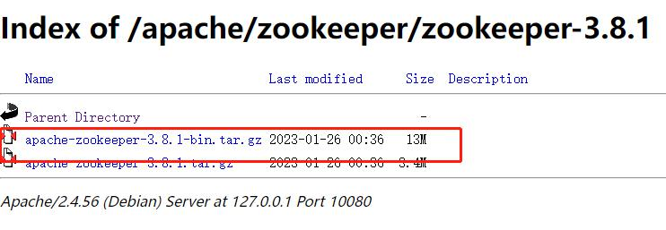

# zookeeper

## 安装

### windows
[](https://blog.51cto.com/u_13348545/6264654)
1. 下载
[官方地址](https://dlcdn.apache.org/zookeeper/)
从国内开源网站下载镜像，例如：清华大学开源软件镜像站 | Tsinghua Open Source Mirror
[镜像地址](https://blog.csdn.net/weixin_48526216/article/details/126689548)


2. 解压下载的文件
解压即可使用，免安装

打开Windows PowerShell
执行解压：
```shell
tar -zxvf .\apache-zookeeper-3.6.3-bin.tar.gz
```

3. 修改配置
- 进入conf目录，复制一份zoo_sample.cfg 为 zoo_sample-副本.cfg
- 重命名 zoo_sample-副本.cfg 为 zoo.cfg 

找到dataDir=/tmp/zookeeper，修改dataDir，增加dataLogDir。E:\app\apache-zookeeper-3.8.1-bin为软件路径
```
# dataDir=/tmp/zookeeper
dataDir=E:\app\apache-zookeeper-3.8.1-bin\data
dataLogDir=E:\app\apache-zookeeper-3.8.1-bin\log
```

4. 运行
执行bin目录下 zkServer.cmd

> 坑 执行闪退
编辑zkServer.cmd文件,末尾添加pause 

```
setlocal
call "%~dp0zkEnv.cmd"

set ZOOMAIN=org.apache.zookeeper.server.quorum.QuorumPeerMain
set ZOO_LOG_FILE=zookeeper-%USERNAME%-server-%COMPUTERNAME%.log

echo on
call %JAVA% "-Dzookeeper.log.dir=%ZOO_LOG_DIR%" "-Dzookeeper.log.file=%ZOO_LOG_FILE%" "-XX:+HeapDumpOnOutOfMemoryError" "-XX:OnOutOfMemoryError=cmd /c taskkill /pid %%%%p /t /f" -cp "%CLASSPATH%" %ZOOMAIN% "%ZOOCFG%" %*
pause
endlocal

```

如果出现Error: JAVA_HOME is not set.，需要安装java环境
[安装java教程](https://www.runoob.com/java/java-environment-setup.html)


### linux
1. 配置 Java 环境（如未安装）
```shell
rpm -ivh jdk-8u341-linux-x64.rpm
```
2. 解压安装包
```shell
tar -zxvf apache-zookeeper-3.8.0-bin.tar.gz
```
3. 修改配置
   ```shell
   cd apache-zookeeper-3.8.0-bin
   # 准备配置文件
   cp zoo_sample.cfg  zoo.cfg 
   # 调整配置文件
   vim zoo.cfg
   ```
   ```shell
   # The number of milliseconds of each tick
   tickTime=2000
   # The number of ticks that the initial
   # synchronization phase can take
   initLimit=10
   # The number of ticks that can pass between
   # sending a request and getting an acknowledgement
   syncLimit=5
   # the directory where the snapshot is stored.
   # do not use /tmp for storage, /tmp here is just
   # example sakes.
   dataDir=/workspace/soft/apache-zookeeper-3.8.0-bin/data
   # the port at which the clients will connect
   clientPort=2181
   # the maximum number of client connections.
   # increase this if you need to handle more clients
   #maxClientCnxns=60
   #
   # Be sure to read the maintenance section of the
   # administrator guide before turning on autopurge.
   #
   # https://zookeeper.apache.org/doc/current/zookeeperAdmin.html#sc_maintenance
   #
   # The number of snapshots to retain in dataDir
   #autopurge.snapRetainCount=3
   # Purge task interval in hours
   # Set to "0" to disable auto purge feature
   #autopurge.purgeInterval=1
   
   ## Metrics Providers
   #
   # https://prometheus.io Metrics Exporter
   #metricsProvider.className=org.apache.zookeeper.metrics.prometheus.PrometheusMetricsProvider
   #metricsProvider.httpHost=0.0.0.0
   #metricsProvider.httpPort=7000
   #metricsProvider.exportJvmInfo=true
   audit.enable=true

   ```
   
4. 启动 zookeeper
   ```shell
      cd bin
    ./zkServer.sh start 
   # 查看服务状态
   ./zkServer.sh status
   ```
5. 连接 zookeeper
   ```shell
   ./zkCli.sh -server localhost:2181
   ```