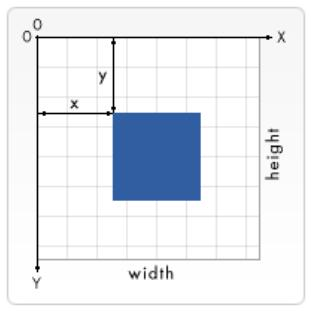

# canvas 坐标

# 标签
```html
<canvas id="canvas"></canvas>
```
# 绘制
```js
let canvas = document.getElementById('tutorial');
let ctx = canvas.getContext('2d');

ctx.fillStyle = "rgb(200,0,0)";
ctx.fillRect (10, 10, 55, 50);

ctx.fillStyle = "rgba(0, 0, 200, 0.5)";
ctx.fillRect (30, 30, 55, 50);
```


# 完整代码
```html
<html>
 <meta charset="utf-8">
 <body onload="draw();">
 
   <canvas id="canvas" width="150" height="150"></canvas>
	 
   <script type="application/javascript">
     function draw() {
       let canvas = document.getElementById("canvas");
       if (canvas.getContext) {
         let ctx = canvas.getContext("2d");
   
         ctx.fillStyle = "rgb(200,0,0)";
         ctx.fillRect (10, 10, 55, 50);
   
         ctx.fillStyle = "rgba(0, 0, 200, 0.5)";
         ctx.fillRect (30, 30, 55, 50);
       }
     }
   </script>
	 
 </body>
</html>
```


# 效果

<canvas id="tutorial" width="150" height="150"></canvas>

<script setup>
import { ref, onMounted  } from 'vue'
const count = ref(0)

onMounted(() => {
  let canvas = document.getElementById('tutorial');
  let ctx = canvas.getContext('2d');
  
  ctx.fillStyle = "rgb(200,0,0)";
  ctx.fillRect (10, 10, 55, 50);

  ctx.fillStyle = "rgba(0, 0, 200, 0.5)";
  ctx.fillRect (30, 30, 55, 50);
})
</script>

[mdn Canvas教程](https://developer.mozilla.org/zh-CN/docs/Web/API/Canvas_API/Tutorial)